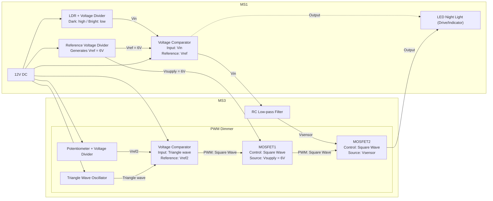
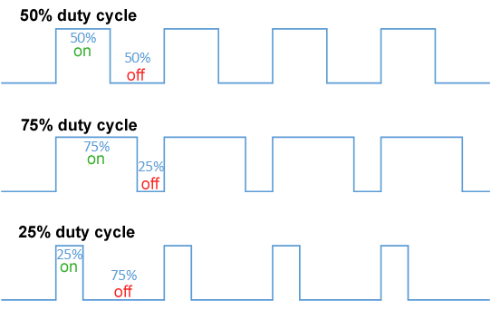
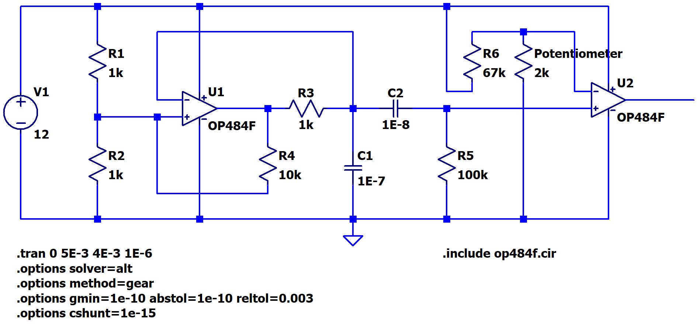
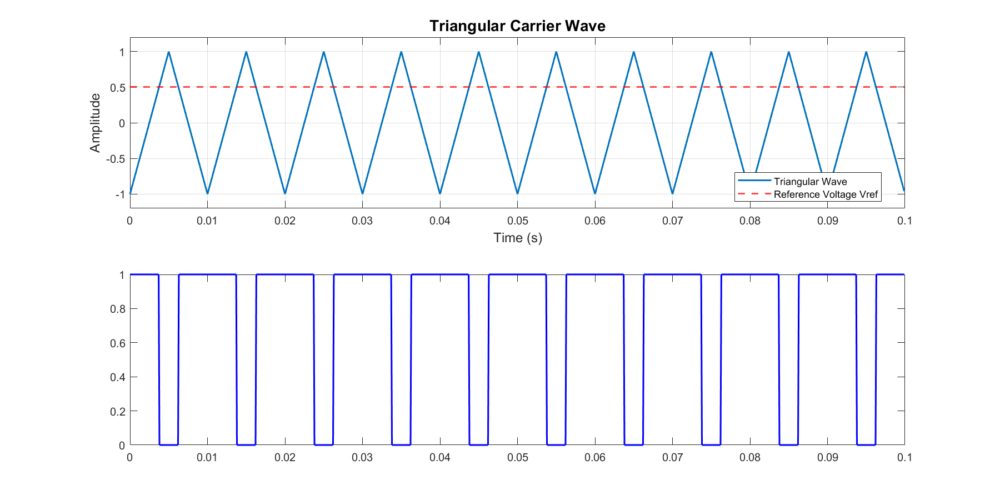
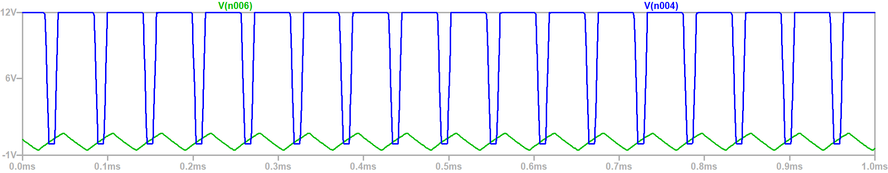
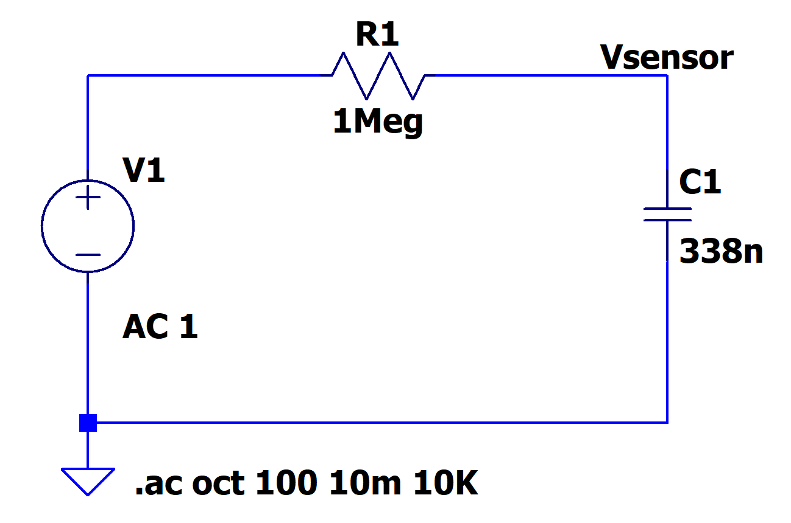
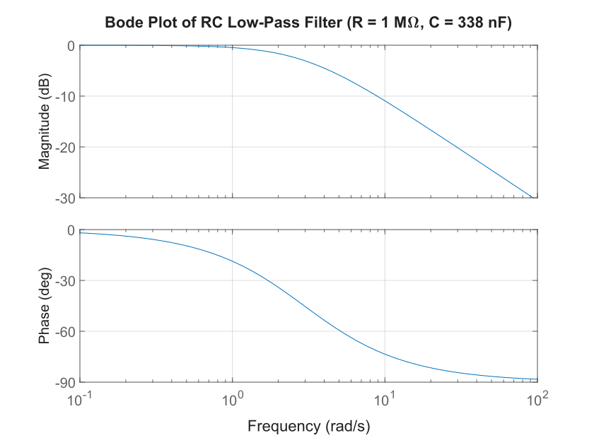
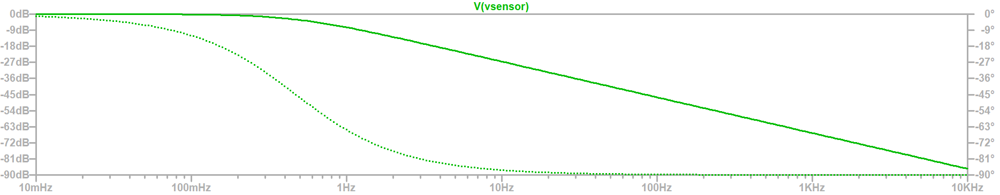
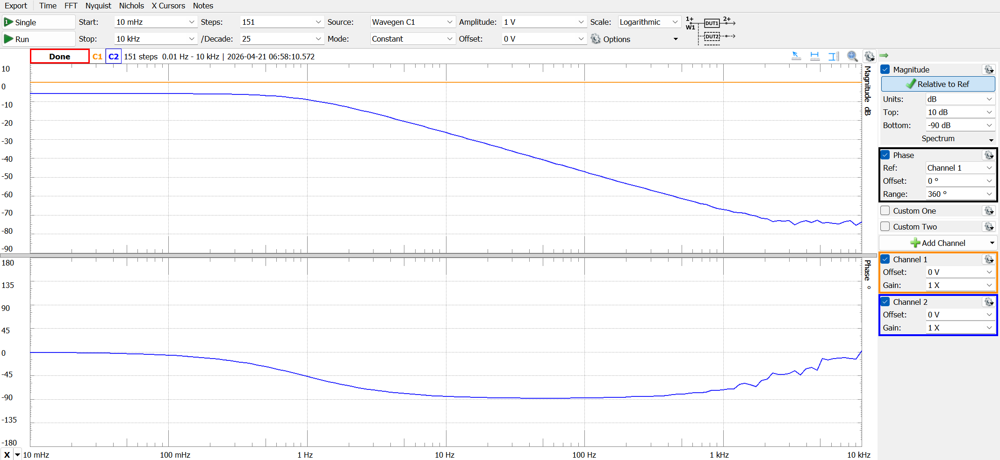
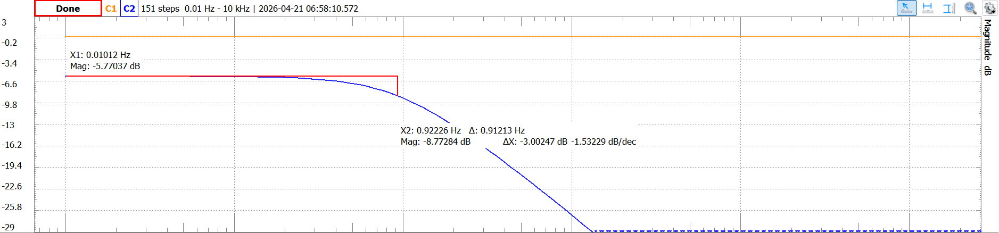

---
# try also 'default' to start simple
theme: apple-basic
# random image from a curated Unsplash collection by Anthony
# like them? see https://unsplash.com/collections/94734566/slidev
image: https://minio-lv-a.jamesflare.com/public/ecse-2010-ms1/luca-bravo-SgtU7sK6oP4-unsplash.avif
# some information about your slides (markdown enabled)
title: Omega Lab MS3
info: |
  This the slides for group presentation on Milestone 3
# https://sli.dev/features/drawing
drawings:
  persist: false
# slide transition: https://sli.dev/guide/animations.html#slide-transitions
transition: slide-left
# enable MDC Syntax: https://sli.dev/features/mdc
mdc: true
# duration of the presentation
duration: 15min
layout: intro-image
hideInToc: true
---

# Omega Lab MS3

An automatic night light

<div class="absolute bottom-10">
  <span class="font-700">
    Jinshan Zhou, Neha Madhwesh, Alexis Wilkerson - 4/22/2026
  </span>
</div>

---
layout: image-right
image: https://minio-lv-a.jamesflare.com/public/ecse-2010-ms1/luca-bravo-SgtU7sK6oP4-unsplash.avif
transition: slide-left
hideInToc: true
---

# Table of Content

<Toc text-sm minDepth="1" maxDepth="2" />

---
layout: section
transition: slide-up
level: 1
---

# Introduction

---
layout: image-right
image: https://minio-lv-a.jamesflare.com/public/ecse-2010-ms1/luca-bravo-SgtU7sK6oP4-unsplash.avif
transition: slide-up
level: 2
---

# Goal

```diff
- Of MS1
+ Of MS3

- Design a smart night light that automatically switches on and off using a photoresistor
+ PWM-based dimming function
- Practice Op-amp
+ Practice filter, and oscillator
- Getting prepared for next Milestone
```

---
transition: slide-left
level: 2
---

# Block Diagram

Of MS1 + MS3



---
layout: section
transition: slide-up
level: 1
---

# Design

---
layout: two-cols
transition: slide-left
level: 2
---

# Design Choice

Why using this setup?

A night light needs

- Dimming - Pulse-width modulation (PWM)
- Anti-flicker - Low-pass Filter

::right::

# Pulse-width Modulation

Oscillator

{width=100%}

---
layout: section
transition: slide-up
level: 1
---

# Stages

---
level: 2
transition: slide-up
---

# Stage 1: PWM Dimmer

Creating modulated square wave for dimming

{width=800px}

---
level: 2
transition: slide-up
hideInToc: true
---

# Stage 1: PWM Dimmer

The triangular wave enters the voltage comparator, and the output is modulated into a square wave

{width=750px}

---
level: 2
transition: slide-up
hideInToc: true
---

# Stage 1: PWM Dimmer

Simulation

Running LTSpice, we got this result

{width=500px}
{width=500px}

---
level: 2
transition: slide-up
layout: two-cols
hideInToc: true
---

# Stage 1: PWM Dimmer

Experimental

{width=400px}

::right::

{width=300px}

---
level: 2
transition: slide-up
---

# Stage 2: RC Low-pass Filter

Smooth the flickering of the light

{width=500px}

---
level: 2
transition: slide-up
hideInToc: true
layout: two-cols
---

# Stage 2: RC Low-pass Filter

Analysis of Transfer Function

For an RC low-pass filter, the transfer function $H(s)$ in the Laplace domain is:

$$
H(s) = \frac{V_{\text{sensor}}(s)}{V_{\text{in}}(s)} = \frac{1}{1 + sRC}
$$

Substituting $R = 1 \text{ M}\Omega$ and $C = 338 \text{ nF}$:

$$
RC = (10^6)(338 \times 10^{-9}) = 0.338 \text{ s}
$$

Thus:

$$
H(s) = \frac{1}{1 + 0.338s}
$$

::right::

In the frequency domain ($s = j\omega$):

$$
H(j\omega) = \frac{1}{1 + j\omega(0.338)} = \frac{1}{1 + j\frac{\omega}{\omega_c}}
$$

where $\omega_c = \frac{1}{RC} = \frac{1}{0.338} \approx 2.9586 \text{ rad/s}$.

---
level: 2
transition: slide-up
hideInToc: true
layout: two-cols
---

# Stage 2: RC Low-pass Filter

Analysis of Bode Plot

The magnitude and phase of the transfer function are:

**Magnitude (in dB):**
$$
|H(j\omega)|_{\text{dB}} = 20 \log_{10} \left| \frac{1}{1 + j\frac{\omega}{\omega_c}} \right|
$$

$$
|H(j\omega)|_{\text{dB}} = -20 \log_{10} \left( \sqrt{1 + \left(\frac{\omega}{\omega_c}\right)^2} \right)
$$

**Phase:**
$$
\angle H(j\omega) = -\tan^{-1}\left(\frac{\omega}{\omega_c}\right)
$$

::right::

**Bode Plot:**

{width=100%}

---
level: 2
transition: slide-up
hideInToc: true
---

# Stage 2: RC Low-pass Filter

Analysis of Poles and Zeros

From $H(s) = \frac{1}{1 + 0.338s}$:

- **Zeros**: None (numerator is constant)
- **Poles**: Solve $1 + 0.338s = 0$

$$
s = -\frac{1}{0.338} \approx -2.9586 \text{ rad/s}
$$

Thus, there is **one pole** at $s = -2.9586 \text{ rad/s}$ (on the negative real axis), and **no zeros**.

---
level: 2
transition: slide-up
hideInToc: true
---

# Stage 2: RC Low-pass Filter

Analysis of Cutoff Frequency

The cutoff frequency (−3 dB frequency) is:

$$
f_c = \frac{1}{2\pi RC} = \frac{1}{2\pi \cdot 0.338} \approx \boxed{0.4709 \text{ Hz}}
$$

In angular frequency:

$$
\omega_c = 2\pi f_c = \frac{1}{RC} \approx \boxed{2.9586 \text{ rad/s}}
$$

---
level: 2
transition: slide-up
hideInToc: true
---

# Stage 2: RC Low-pass Filter

Analysis of Roll-off in dB

For a first-order low-pass filter, the roll-off rate beyond the cutoff frequency is:

$$
\text{Roll-off} = \boxed{-20 \text{ dB/decade}} \quad \text{or} \quad \boxed{-6 \text{ dB/octave}}
$$

This means that for every tenfold increase in frequency above $f_c$, the output magnitude decreases by 20 dB.

---
level: 2
transition: slide-up
hideInToc: true
---

# Stage 2: RC Low-pass Filter

Analysis Summary Table

| Parameter | Value |
|-----------|-------|
| Transfer Function | $H(s) = \frac{1}{1 + 0.338s}$ |
| Pole | $s = -2.9586 \text{ rad/s}$ |
| Zeros | None |
| Cutoff Frequency ($f_c$) | $0.4709 \text{ Hz}$ |
| Cutoff Frequency ($\omega_c$) | $2.9586 \text{ rad/s}$ |
| Roll-off | $-20 \text{ dB/decade}$ |

---
level: 2
transition: slide-up
hideInToc: true
---

# Stage 2: RC Low-pass Filter

Simulation

{width=350px}
{width=700px}

---
level: 2
transition: slide-up
hideInToc: true
---

# Stage 2: RC Low-pass Filter

Simulation

**Cursor 1: V(vsensor)**

| Parameter | Value |
|-----------|-------|
| Freq | 474.09139mHz |
| Mag | -3.0400086dB |
| Phase | -45.195162° |
| Group Delay | 167.84906ms |

---
level: 2
transition: slide-up
layout: two-cols
hideInToc: true
---

# Stage 2: RC Low-pass Filter

Experimental

{width=400px}

::right::

{width=500px}
{width=500px}

---
level: 2
transition: slide-up
hideInToc: true
---

# Stage 2: RC Low-pass Filter

Experimental

**Differences (Δ)**

| Parameter | Value |
|-----------|-------|
| X2 (Frequency) | 0.92226 Hz |
| ΔMag (Magnitude) | -3.00247 dB |

---
level: 2
transition: slide-up
hideInToc: true
---

# Stage 2: RC Low-pass Filter

Discussion

| Parameter | Design (calc) | LTspice | Measured | Abs. error | % error |
|-----------|---------------|---------|----------|------------|---------|
| $f_c$ (cutoff) | $0.4709 \text{ Hz}$ | $0.4741 \text{ Hz}$ | $0.9223 \text{ Hz}$ | $+0.4514 \text{ Hz}$ | $+95.86\%$ |
| $\|H\|@f_c$ | $-3.01 \text{ dB}$ | $-3.04 \text{ dB}$ | $-3.00 \text{ dB}$ | $+0.01 \text{ dB}$ | $+0.33\%$ |
| $\angle H @ f_c$ | $-45.0^\circ$ | $-45.2^\circ$ | $\approx -45^\circ$ | $\approx 0^\circ$ | $\approx 0\%$ |

Cutoff Frequency Discrepancy
- Absolute Error is Small
- Leakage Current

---
level: 1
transition: slide-left
layout: section
---

# Demo

---
layout: end
title: Q&A
hideInToc: true
---

# Thank You

Low-frequency PWM dimming can cause eye fatigue.  
What is the DC-like dimming?
